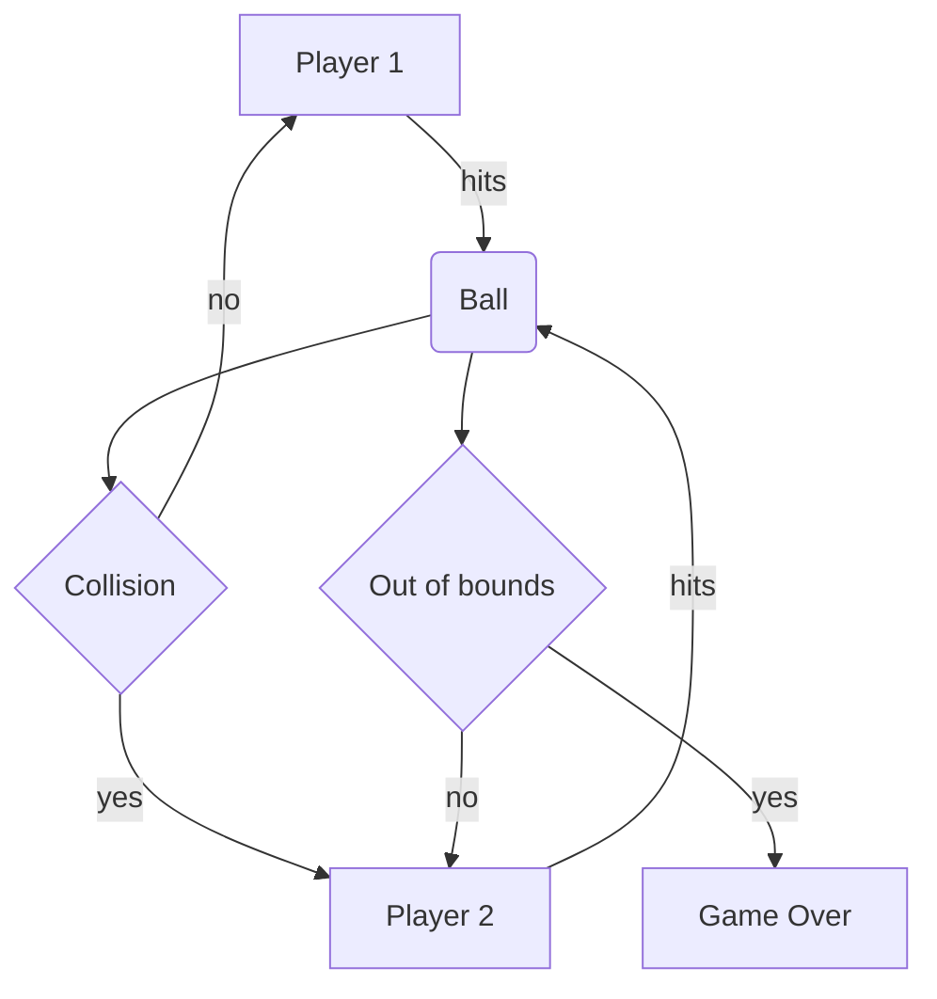

```mermaid
  graph TD;
    A[Player 1] -->|hits| B(Ball);
    B --> C{Collision};
    C -->|yes| D[Player 2];
    C -->|no| A;
    D -->|hits| B;
    B --> E{Out of bounds};
    E -->|yes| F[Game Over];
    E -->|no| D;
```